# RuoYi AI


<!-- PROJECT SHIELDS -->

[![Contributors][contributors-shield]][contributors-url]
[![Forks][forks-shield]][forks-url]
[![Stargazers][stars-shield]][stars-url]
[![Issues][issues-shield]][issues-url]
[![MIT License][license-shield]][license-url]


<!-- PROJECT LOGO -->
<br />


<h3 style="text-align: center;">快速搭建属于自己的 AI 助手平台</h3>

<p style="text-align: center;">
    全新升级，开箱即用，简单高效
    <br />
    <a href="https://doc.pandarobot.chat"><strong>探索本项目的文档 »</strong></a>
    <br />
    <br />
    <a href="https://web.pandarobot.chat">项目预览</a>
    ·
    <a href="https://github.com/ageerle/ruoyi-ai/issues">报告Bug</a>
    ·
    <a href="https://github.com/ageerle/ruoyi-ai/issues">提出新特性</a>
</p>

## 目录

- [系统体验](#系统体验)
- [源码地址](#源码地址)
- [配套文档](#项目文档)
- [核心功能](#核心功能)
- [项目演示](#项目演示)
  - [管理端](#管理端)
  - [用户端](#用户端)
  - [小程序端](#小程序端)
- [开发环境](#开发环境)
- [项目结构](#项目结构)
  - [ruoyi-ai](#ruoyi-ai)
- [注意事项](#注意事项)
  - [vben模板](#vben模板)
- [贡献者](#贡献者)
  - [如何参与开源项目](#如何参与开源项目)
- [版本控制](#版本控制)
- [作者](#作者)
- [鸣谢](#鸣谢)
- [技术讨论群](#技术讨论群)

### 系统体验
- 用户端：https://web.pandarobot.chat
- 管理端：https://admin.pandarobot.chat
  用户名: admin 密码：admin123

### 源码地址
[1]github
- 前端服务-用户端: https://github.com/ageerle/ruoyi-web
- 前端服务-管理端: https://github.com/ageerle/ruoyi-admin
- 前端服务-小程序端: https://github.com/ageerle/ruoyi-uniapp
- 后端服务：https://github.com/ageerle/ruoyi-ai

[2]gitcode
- 前端服务-用户端：https://gitcode.com/ageerle/ruoyi-web
- 前端服务-管理端:  https://gitcode.com/ageerle/ruoyi-admin
- 前端服务-小程序端:  https://gitcode.com/ageerle/ruoyi-uniapp
- 后端服务：https://gitcode.com/ageerle/ruoyi-ai

### 配套文档
- 配套文档: https://doc.pandarobot.chat
- 项目部署文档：https://doc.pandarobot.chat/guide/introduction/

### 核心功能与技术亮点
1. 全栈式开源系统
  ○ 全套开源系统：提供完整的前端应用、后台管理以及小程序应用，基于MIT协议，开箱即用。
2. 本地化 RAG 方案
  ○ 基于 Langchain4J 框架，支持 Milvus/Weaviate/Qdrant 向量库，结合 BGE-large-zh-v1.5 本地向量化模型 实现高效文档检索与知识库构建。
  ○ 支持 本地 LLM 接入，结合私有知识库实现安全可控的问答系统，避免依赖云端服务的隐私风险。
3. 多模态 AI 引擎与工具集成
  ○ 智能对话：支持 OpenAI GPT-4、Azure、ChatGLM 等主流模型，内置 SSE/WebSocket 协议实现低延迟交互，兼容 扣子、DIFY 等平台 API 调用。
  ○ Spring AI MCP 工具链：通过注解快速定义本地工具，支持调用 MCP 广场 的海量 MCP Server 服务，扩展模型能力边界。
4. 企业级扩展与商业化支持
  ○ 即时通讯集成：支持对接个人微信、企业微信及微信公众号，实现消息自动回复、用户管理与智能客服37。
  ○ 支付系统：集成易支付、微信支付、Stripe 国际信用卡支付，满足商业化场景需求。
5. 多媒体处理与创新功能
  ○ AI 绘画：集成 DALL·E-3、MidJourney、Stable Diffusion，支持文生图、图生图及风格化创作，适用于营销素材生成与创意设计34。
  ○ PPT 制作：根据文本输入自动生成结构化幻灯片，支持自定义模板(需要使用三方平台 如：文多多)。

### 项目演示

#### mcp支持
<div style="display: flex; flex-wrap: wrap; gap: 20px; justify-content: center;">
  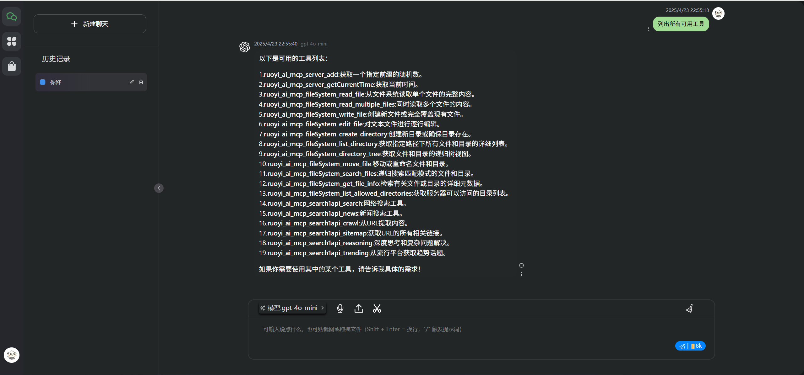
  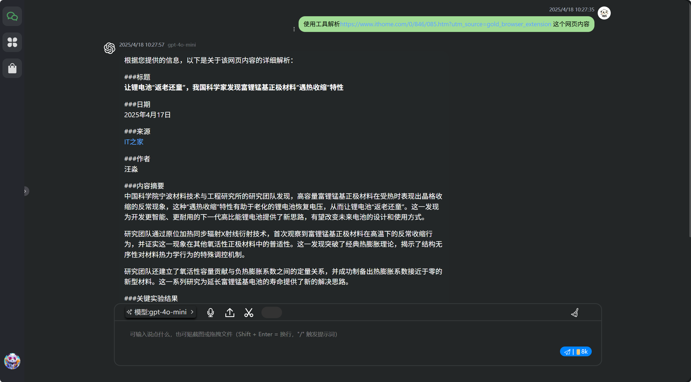
  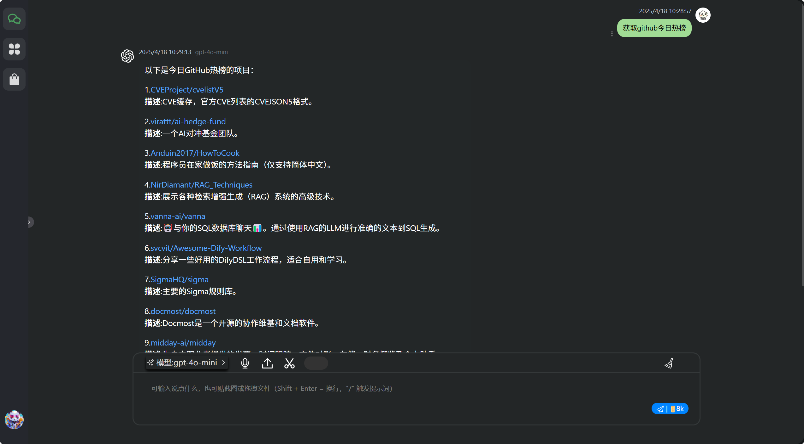
  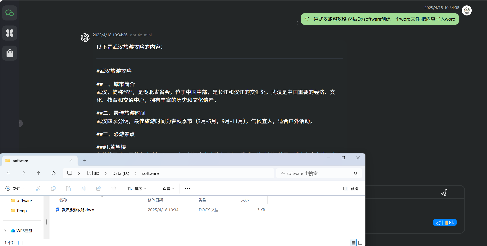
</div>

#### 管理端
<div style="display: flex; flex-wrap: wrap; gap: 20px; justify-content: center;">
  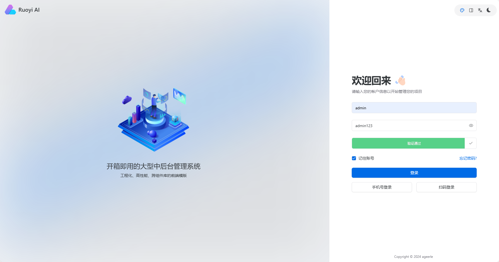
  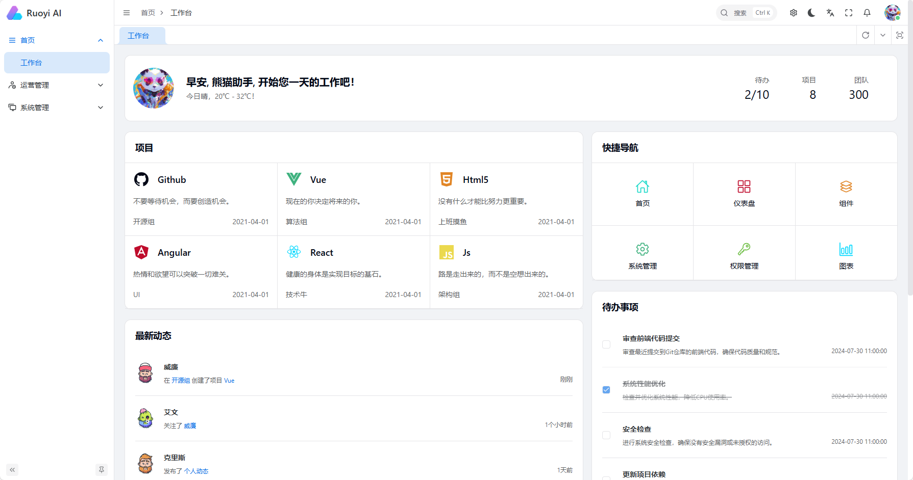
  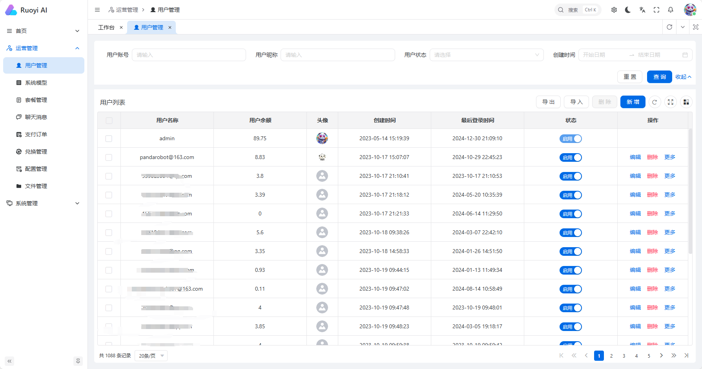
  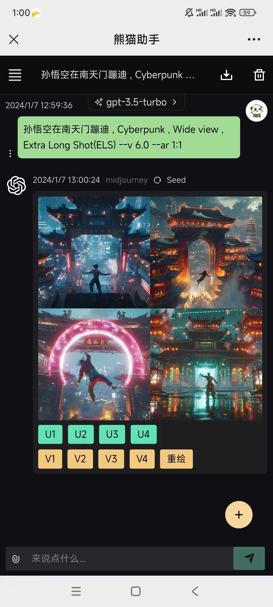
</div>

#### 用户端
<div style="display: flex; flex-wrap: wrap; gap: 20px; justify-content: center;">
  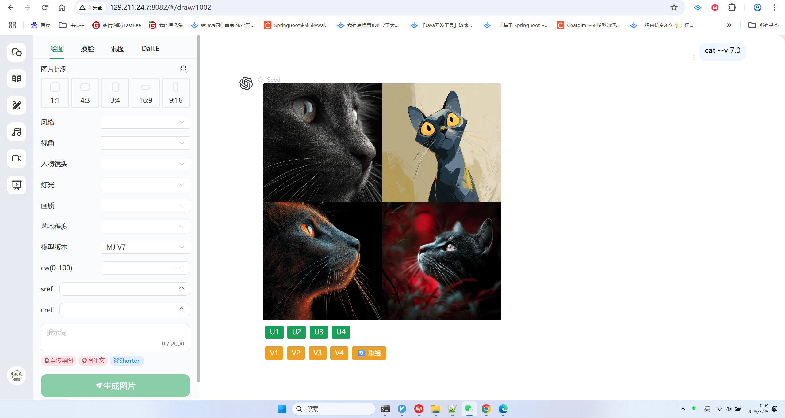
  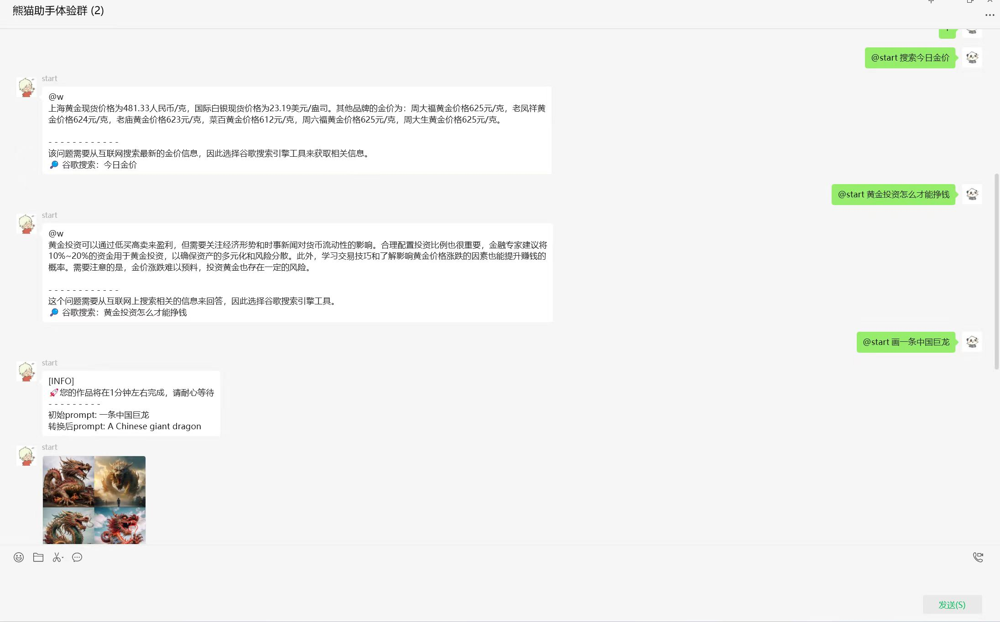
  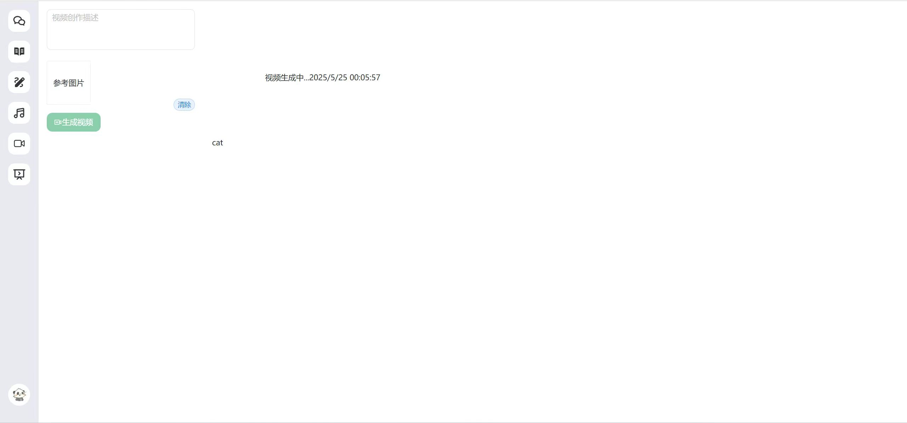
  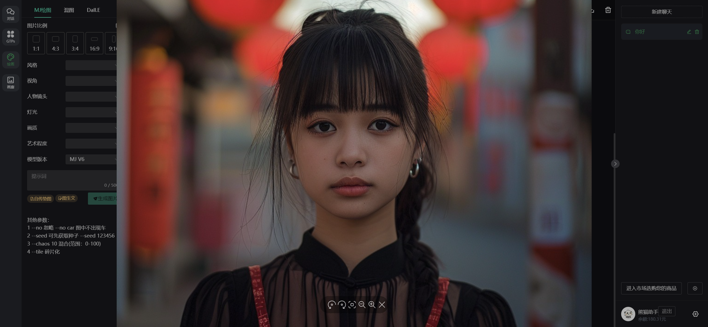
</div>

#### 小程序端
<div style="display: flex; flex-wrap: wrap; gap: 20px; justify-content: flex-start;">
  
  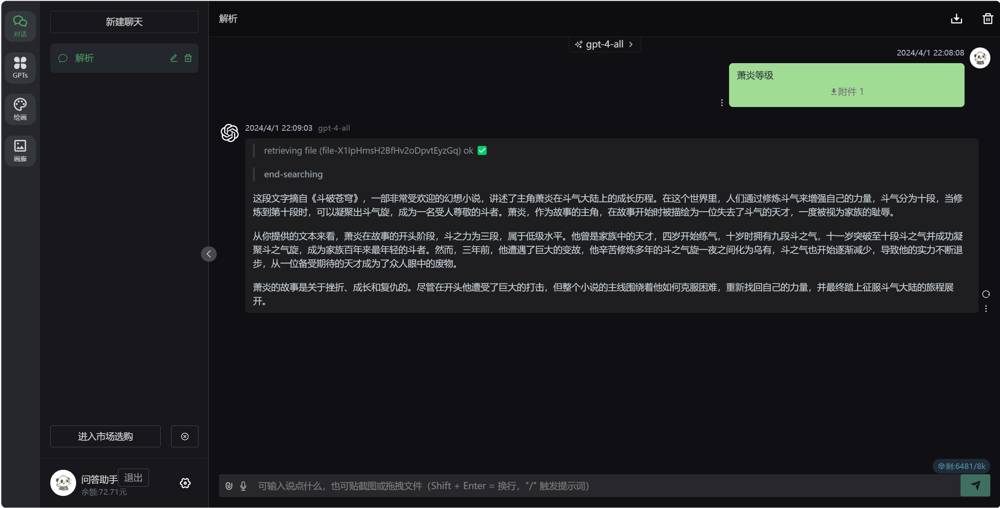
</div>

### 开发环境

1. jdk 17
2. mysql 5.7、8.0
3. redis 版本必须 >= 5.X
4. maven 3.8+
5. nodejs 20+ & pnpm

- 附-部署配套视频：https://www.bilibili.com/video/BV1jDXkYWEba

<div>
  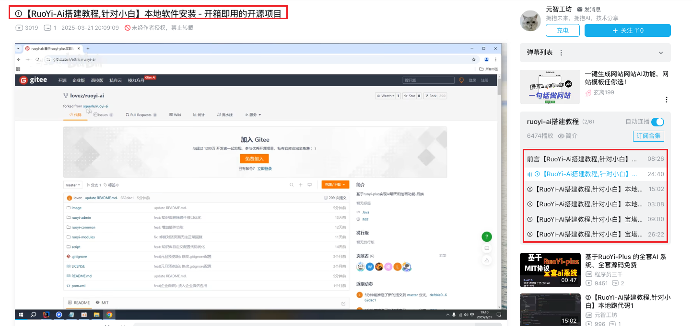
</div>

### 项目结构
- RuoYi-AI

```
├─ ruoyi-admin                         // 管理模块
│  └─ RuoYiApplication                 // 启动类
│  └─ RuoYiServletInitializer          // 容器部署初始化类
│  └─ resources                        // 资源文件
│      └─ i18n/messages.properties     // 国际化配置文件
│      └─ application.yml              // 框架总配置文件
│      └─ application-dev.yml          // 开发环境配置文件
│      └─ application-prod.yml         // 生产环境配置文件
│      └─ banner.txt                   // 框架启动图标
│      └─ logback-plus.xml             // 日志配置文件
│      └─ ip2region.xdb                // IP区域地址库
├─ ruoyi-common                        // 通用模块
│  └─ ruoyi-common-bom                 // common依赖包管理
   └─ ruoyi-common-chat                // 聊天模块
│  └─ ruoyi-common-core                // 核心模块
│  └─ ruoyi-common-doc                 // 系统接口模块
│  └─ ruoyi-common-encrypt             // 数据加解密模块
│  └─ ruoyi-common-excel               // excel模块
│  └─ ruoyi-common-idempotent          // 幂等功能模块
│  └─ ruoyi-common-json                // 序列化模块
│  └─ ruoyi-common-log                 // 日志模块
│  └─ ruoyi-common-mail                // 邮件模块
│  └─ ruoyi-common-mybatis             // 数据库模块
│  └─ ruoyi-common-oss                 // oss服务模块
│  └─ ruoyi-common-pay                 // 支付模块
│  └─ ruoyi-common-ratelimiter         // 限流功能模块
│  └─ ruoyi-common-redis               // 缓存服务模块
│  └─ ruoyi-common-satoken             // satoken模块
│  └─ ruoyi-common-security            // 安全模块
│  └─ ruoyi-common-sensitive           // 脱敏模块
│  └─ ruoyi-common-sms                 // 短信模块
│  └─ ruoyi-common-tenant              // 租户模块
│  └─ ruoyi-common-translation         // 通用翻译模块
│  └─ ruoyi-common-web                 // web模块
├─ ruoyi-modules                       // 模块组
│  └─ ruoyi-demo                       // 演示模块
│  └─ ruoyi-system                     // 业务模块
├─ .run                 // 执行脚本文件
├─ .editorconfig        // 编辑器编码格式配置
├─ LICENSE              // 开源协议
├─ pom.xml              // 公共依赖
├─ README.md            // 框架说明文件


```

### 注意事项
- vben模板

    Q：vben5 的模板默认是没有的吗？
  
    A：vben模板是收费的 请联系vben-vue-plus作者获取。

### 版本控制

该项目使用Git进行版本管理。您可以在repository参看当前可用版本。


### 版权说明

该项目使用了MIT授权许可，详情请参阅 [LICENSE.txt](https://github.com/ageerle/ruoyi-ai/blob/main/LICENSE)

###  项目现状

目前，项目还处于早期阶段，距离成熟还有很长的路要走。由于个人精力有限，项目的发展速度受到了一定的限制。为了加快项目的进度，我真诚地希望更多人能够参与到项目中来。无论是经验丰富的开发者，还是刚刚入门的小白，我都热烈欢迎你们提交Pull Request（PR）👏👏👏。即使代码修改得很少，或者存在一些错误，都没有关系。我会认真审核每一位贡献者的代码，并和大家一起完善项目⛽️⛽️⛽️。

###  开发计划

| 主题 | 方向                                | 时间节点   | 
| --- |-----------------------------------|--------| 
| 前端简化版 | 与element-plus-x框架合作，推出基于该框架的前端简化版 | 2025.5 | 
| agent2agent | Agent2Agent协议支持                   | 2025.6 | 
| 流程编排 | 通过可视化界面和灵活的配置方式，快速构建AI应用          | 2025.7 | 


-  感谢

最后，我要感谢RuoYi-Vue-Plus、chatgpt-java、chatgpt-web-midjourney-proxy等优秀框架。正是因为这些项目的开源和共享，我才能够在这个基础上进行开发，使我们的项目能够取得今天的成果。再次感谢这些项目及其背后的开发者们！

希望更多志同道合的朋友能够加入我们，共同推动这个项目的发展。让我们一起努力，将这个项目打造成一个真正成熟、实用的AI平台！

#### 如何参与开源项目

贡献使开源社区成为一个学习、激励和创造的绝佳场所。你所作的任何贡献，我们都非常感谢！🙏

1. Fork 这个项目
2. 创建你的功能分支 (`git checkout -b feature/dev`)
3. 提交你的更改 (`git commit -m 'Add some dev'`)
4. 推送到分支 (`git push origin feature/dev`)
5. 打开拉取请求
6. pr请提交到GitHub上，会定时同步到gitee

#### 项目文档
1. 项目文档基于vitepress构建
2. 按照[如何参与开源项目](#如何参与开源项目)拉取https://github.com/ageerle/ruoyi-doc
3. 安装依赖：npm install
4. 启动项目：npm run docs:dev
5. 主页路径：docs/guide/introduction/index.md

### 鸣谢
- [chatgpt-java](https://github.com/Grt1228/chatgpt-java)
- [RuoYi-Vue-Plus](https://gitee.com/dromara/RuoYi-Vue-Plus)
- [chatgpt-web-midjourney-proxy](https://github.com/Dooy/chatgpt-web-midjourney-proxy)
- [Vben Admin](https://github.com/vbenjs/vue-vben-admin)
- [Naive UI](https://www.naiveui.com)

<!-- links -->
[your-project-path]:https://github.com/ageerle/ruoyi-ai
[contributors-shield]: https://img.shields.io/github/contributors/ageerle/ruoyi-ai.svg?style=flat-square
[contributors-url]: https://github.com/ageerle/ruoyi-ai/graphs/contributors
[forks-shield]: https://img.shields.io/github/forks/ageerle/ruoyi-ai.svg?style=flat-square
[forks-url]: https://github.com/ageerle/ruoyi-ai/network/members
[stars-shield]: https://img.shields.io/github/stars/ageerle/ruoyi-ai.svg?style=flat-square
[stars-url]: https://github.com/ageerle/ruoyi-ai/stargazers
[issues-shield]: https://img.shields.io/github/issues/ageerle/ruoyi-ai.svg?style=flat-square
[issues-url]: https://img.shields.io/github/issues/ageerle/ruoyi-ai.svg
[license-shield]: https://img.shields.io/github/license/ageerle/ruoyi-ai.svg?style=flat-square
[license-url]: https://github.com/ageerle/ruoyi-ai/blob/master/LICENSE.txt
[linkedin-shield]: https://img.shields.io/badge/-LinkedIn-black.svg?style=flat-square&logo=linkedin&colorB=555

## 🌿 第三方生态
- [PPIO 派欧云：一键调用高性价比的开源模型 API 和 GPU 容器](https://ppinfra.com/user/register?invited_by=P8QTUY&utm_source=github_ruoyi-ai)

### 附：技术讨论群

#### 进群学习
🏠 wx：ruoyi-ai（加人备注：ruoyi-ai）


🏠 qq：1603234088 （加人备注：ruoyi-ai）

👏👏👏 ruoyi-ai官方交流1群（qq区）：1034554687 

<div style="display: flex; flex-wrap: wrap; gap: 20px; justify-content: center;">
  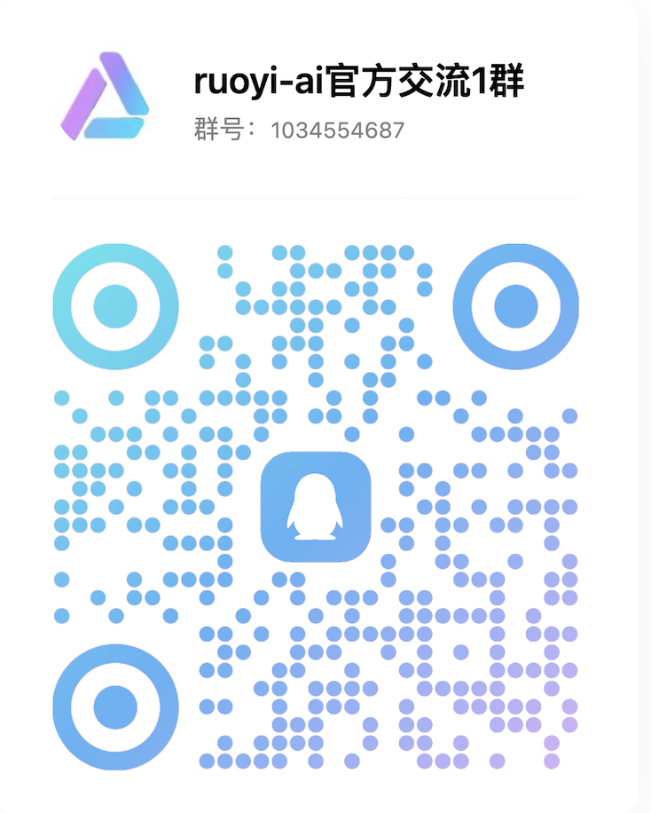
</div>

