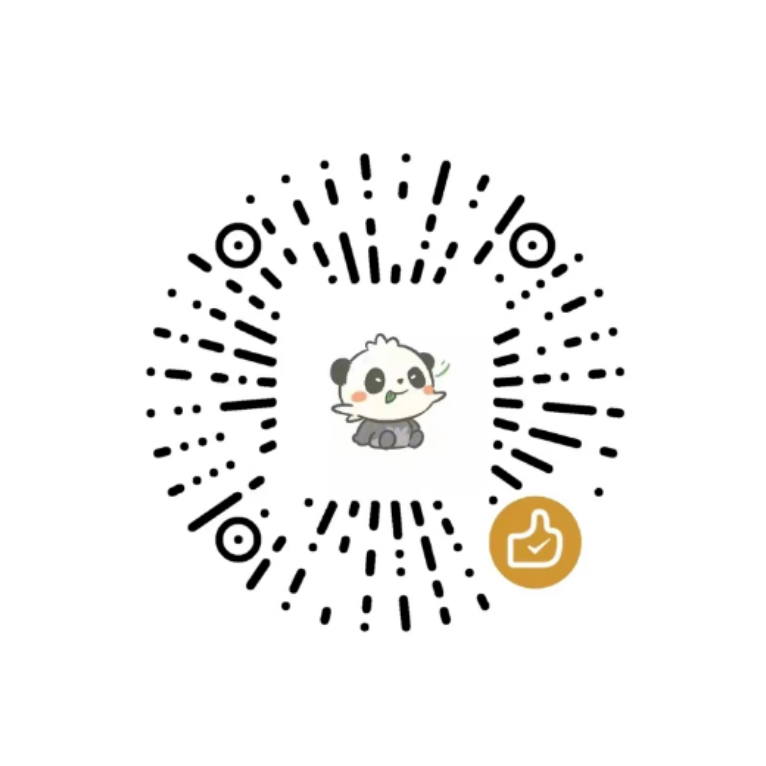

## 平台简介

> 基于ruoyi-plus实现AI聊天和绘画功能-后端

> 本项目完全开源免费！
后台管理界面使用elementUI服务端使用Java17+SpringBoot3.X

实现功能
1. 支持ChatGPT4,Dall-E-3,ChatGPT-4-All,GPTS 模型
2. 支持语音克隆
3. 支持文生图模型
4. 支持微信小程序
5. 支持个人二维码实时到账(易支付)
6. 支持个人微信接入ChatGPT
> 
>项目地址
<ul>
<li>小程序端: https://github.com/ageerle/ruoyi-uniapp</li>
<li>前端-后台管理: https://github.com/ageerle/ruoyi-admin</li>
<li>前端-用户端: https://github.com/ageerle/ruoyi-web</li>
<li>演示地址: https://web.pandarobot.chat</li>
</ul>

## 扫码登录

公众号：熊猫AI办公助手

  

## 小程序演示

  
  

## H5演示

  
  

## PC端演示

  
  

## MJ绘图

  
  

## 私有知识库管理

  
  

## 进群学习

  

## 支持一下

  

## 参考项目
<ol>
<li>https://github.com/Grt1228/chatgpt-java</li>
<li>https://github.com/Dooy/chatgpt-web-midjourn
