## 平台简介

 

> 基于ruoyi-plus实现AI聊天和绘画功能-后端
后台管理界面使用elementUI 服务端使用Java17+SpringBoot3.X

> 项目文档：https://1m29197bp6.k.topthink.com/@ruoyi-ai/xiangmuchushihua.html

实现功能
1. 支持ChatGPT4,Dall-E-3,ChatGPT-4-All(文件对话,图文对话)模型
2. 支持GPTS 可以使用Openai的所有的GPTs
3. 支持语音克隆
4. 支持文生图模型 MidJourney(mj换脸,混图,重绘,角色一致性)
5. 支持微信小程序
6. 支持个人二维码实时到账(易支付)
7. 支持suno-v3（文生音乐）
8. 支持个人微信接入ChatGPT
9. 支持stable-diffusion（对话式）
10. 支持私有知识库

>测试功能: 微信机器人
>
>项目地址
<ul>
<li>小程序端: https://github.com/ageerle/ruoyi-uniapp</li>
<li>前端-后台管理: https://github.com/ageerle/ruoyi-admin</li>
<li>前端-用户端: https://github.com/ageerle/ruoyi-web</li>
<li>演示地址: https://web.pandarobot.chat</li>
</ul>

## 小程序演示

  
  

## H5演示

  
  

## PC端演示

  
  
  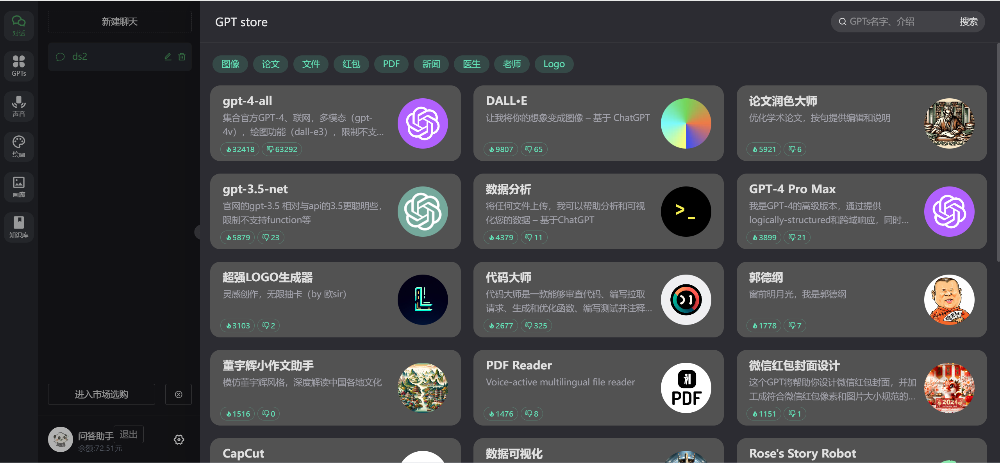
  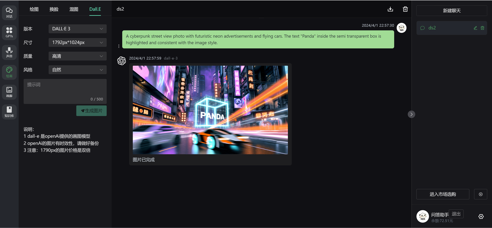

## 绘图(mj换脸、mj混图、mj角色一致(英文)、sd绘图)

  
  
  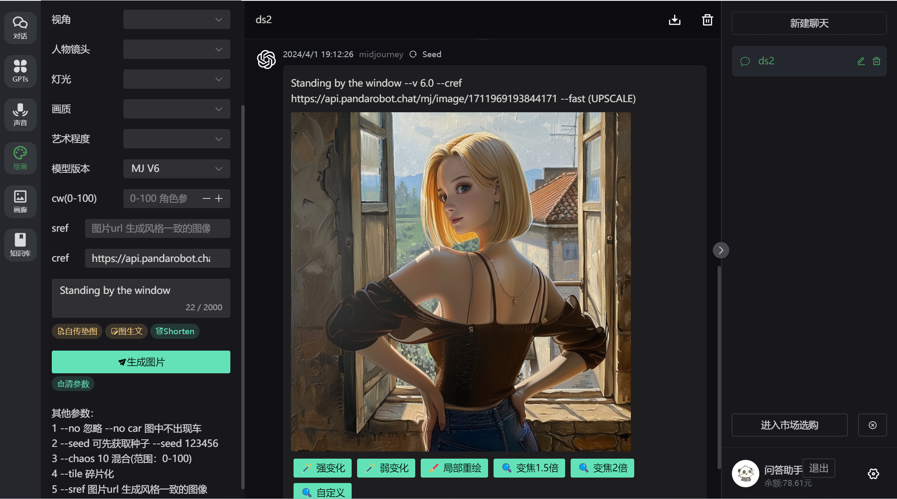
  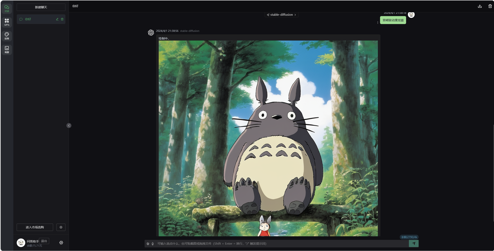

## 语音克隆

  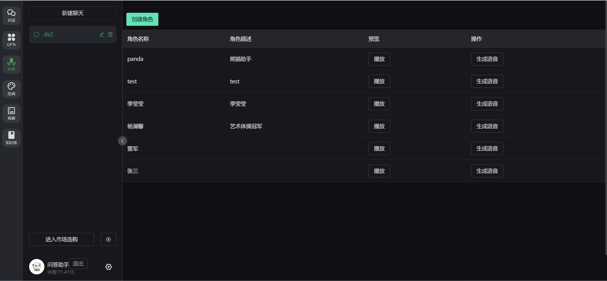
  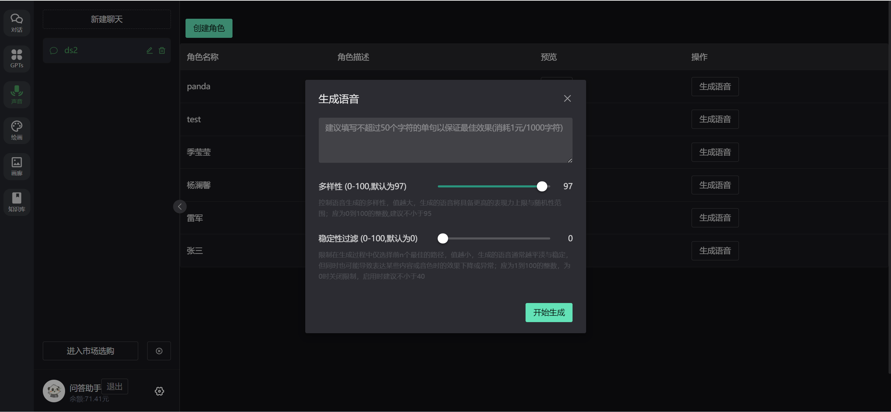

## 知识库

  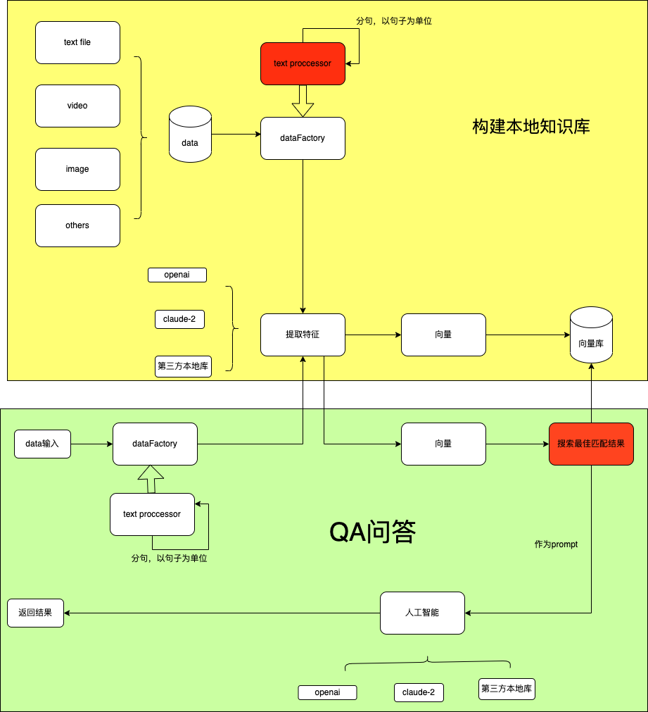
  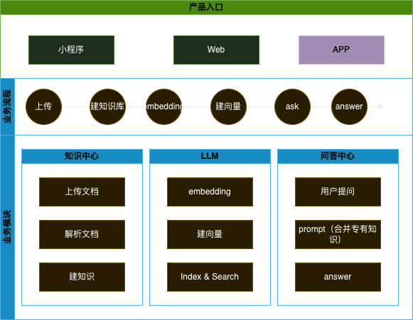
  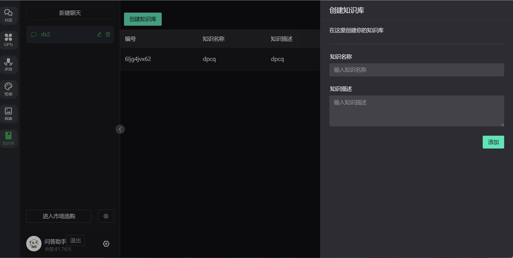
  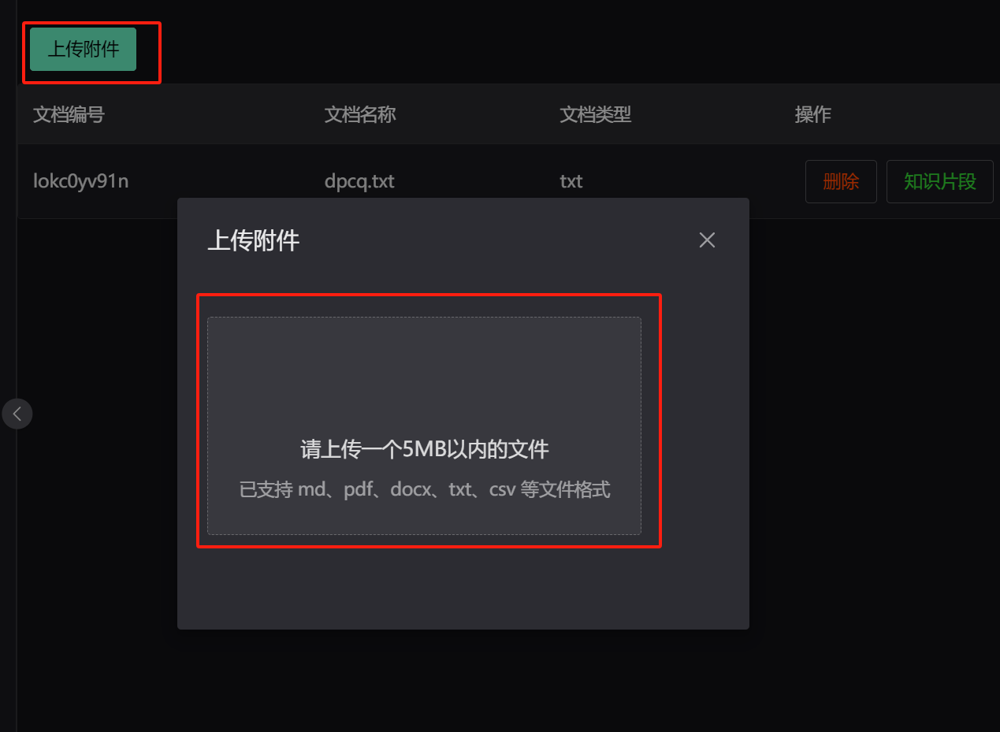
  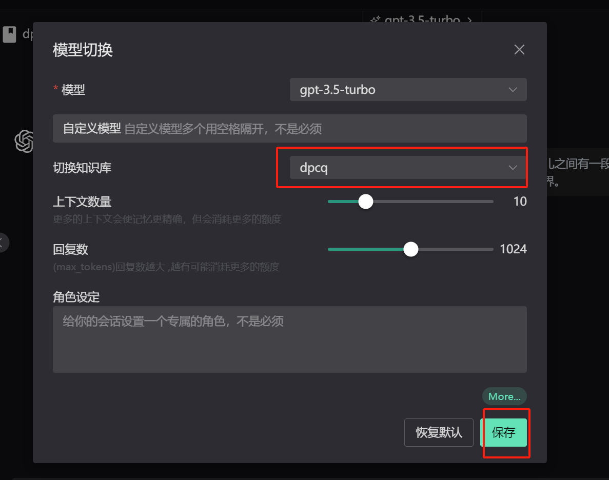
  

## 后台管理

    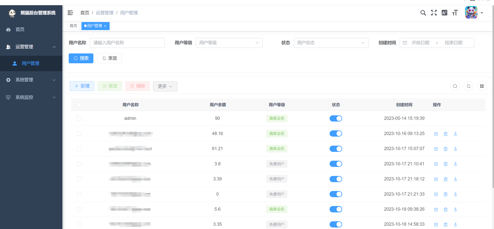
  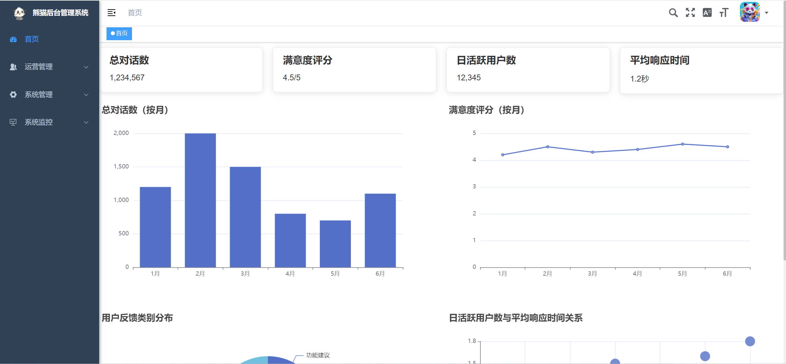

## 进群学习

  

## 参考项目
<ol>
<li>https://github.com/Grt1228/chatgpt-java</li>
<li>https://github.com/Dooy/chatgpt-web-midjourney-proxy</li>
<li>https://gitee.com/dromara/RuoYi-Vue-Plus</li>
</ol>

## Star History

