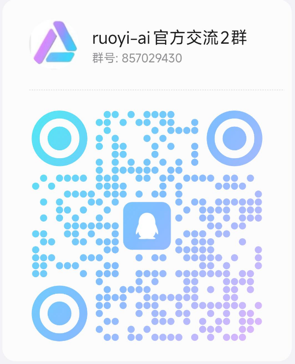

# RuoYi AI

[![Contributors][contributors-shield]][contributors-url]
[![Forks][forks-shield]][forks-url]
[![Stargazers][stars-shield]][stars-url]
[![Issues][issues-shield]][issues-url]
[![MIT License][license-shield]][license-url]

  

### 企业级AI助手平台

*开箱即用的智能AI平台，深度集成 FastGPT、扣子(Coze)、DIFY 等主流AI平台，提供先进的RAG技术、知识图谱、数字人和AI流程编排能力*

**[🇺🇸 English](README_EN.md)** | **[📖 使用文档](https://doc.pandarobot.chat)** | *
*[🚀 在线体验](https://web.pandarobot.chat)** | **[🐛 问题反馈](https://github.com/ageerle/ruoyi-ai/issues)** | *
*[💡 功能建议](https://github.com/ageerle/ruoyi-ai/issues)**

## ✨ 核心亮点

### 智能AI引擎

- **多模型接入**：支持 OpenAI GPT-4、Azure、ChatGLM、通义千问、智谱AI 等主流模型
- **AI平台集成**：深度集成 **FastGPT**、**扣子(Coze)**、**DIFY** 等主流AI应用平台
- **Spring AI MCP 集成**：基于模型上下文协议，打造可扩展的AI工具生态系统
- **实时流式对话**：采用 SSE/WebSocket 技术，提供丝滑的对话体验
- **AI 编程助手**：内置智能代码分析和项目脚手架生成能力

### AI平台生态集成

- **FastGPT 深度集成**：原生支持 FastGPT API，包括知识库检索、工作流编排和上下文管理
- **扣子(Coze) 官方SDK**：集成字节跳动扣子平台官方SDK，支持Bot对话和流式响应
- **DIFY 完整兼容**：使用 DIFY Java Client，支持应用编排、工作流和知识库管理
- **统一聊天接口**：提供统一的聊天服务接口，支持多平台无缝切换和负载均衡

### 本地化RAG方案

- **私有知识库**：基于 Langchain4j 框架 + BGE-large-zh-v1.5 中文向量模型
- **多种向量库**：支持 Milvus、Weaviate、Qdrant 等主流向量数据库
- **数据安全可控**：支持完全本地部署，保护企业数据隐私
- **灵活模型部署**：兼容 Ollama、vLLM 等本地推理框架

### AI创作工具

- **AI 绘画创作**：深度集成 DALL·E-3、MidJourney、Stable Diffusion
- **智能PPT生成**：一键将文本内容转换为精美演示文稿
- **多模态理解**：支持文本、图片、文档等多种格式的智能处理

### 知识图谱与智能编排

- **知识图谱构建**：自动从文档和对话中提取实体关系，构建可视化知识网络
- **AI 流程编排**：可视化工作流设计器，支持复杂AI任务的编排和自动化执行
- **数字人交互**：集成数字人形象，提供更自然的人机交互体验
- **智能推理引擎**：基于知识图谱的智能推理和问答能力

## 🚀 快速体验

### 在线演示

- **用户端体验**：[web.pandarobot.chat](https://web.pandarobot.chat) (账号：admin 密码：admin123)
- **管理后台**：[admin.pandarobot.chat](https://admin.pandarobot.chat) (账号：admin 密码：admin123)

### 项目源码

| 项目模块     | GitHub 仓库                                             | Gitee 仓库                                             | GitCode 仓库                                             |
|----------|-------------------------------------------------------|------------------------------------------------------|--------------------------------------------------------|
| 🔧 后端服务  | [ruoyi-ai](https://github.com/ageerle/ruoyi-ai)       | [ruoyi-ai](https://gitee.com/ageerle/ruoyi-ai)       | [ruoyi-ai](https://gitcode.com/ageerle/ruoyi-ai)       |
| 🎨 用户前端  | [ruoyi-web](https://github.com/ageerle/ruoyi-web)     | [ruoyi-web](https://gitee.com/ageerle/ruoyi-web)     | [ruoyi-web](https://gitcode.com/ageerle/ruoyi-web)     |
| 🛠️ 管理后台 | [ruoyi-admin](https://github.com/ageerle/ruoyi-admin) | [ruoyi-admin](https://gitee.com/ageerle/ruoyi-admin) | [ruoyi-admin](https://gitcode.com/ageerle/ruoyi-admin) |

### 合作项目

| 项目介绍  |                               GitHub 仓库                                |                             Gitee 仓库                             |
|:-----:|:----------------------------------------------------------------------:|:----------------------------------------------------------------:|
| 前端简化版 | [ruoyi-element-ai](https://github.com/element-plus-x/ruoyi-element-ai) | [ruoyi-element-ai](https://gitee.com/he-jiayue/ruoyi-element-ai) |

## 🛠️ 技术架构

### 核心框架

- **后端架构**：Spring Boot 3.4 + Spring AI + Langchain4j
- **数据存储**：MySQL 8.0 + Redis + 向量数据库（Milvus/Weaviate/Qdrant）
- **前端技术**：Vue 3 + Vben Admin + Naive UI
- **安全认证**：Sa-Token + JWT 双重保障

### 系统组件

- **文档处理**：PDF、Word、Excel 解析，图像智能分析  
- **实时通信**：WebSocket 实时通信，SSE 流式响应  
- **系统监控**：完善的日志体系、性能监控、服务健康检查  

## 📚 使用文档

想要深入了解安装部署、功能配置和二次开发？

**👉 [完整使用文档](https://doc.pandarobot.chat)**

遇到知识库或 RAG 回答异常问题？

**👉 [RAG 回答异常排查手册](docs/troubleshooting/rag-failures.md)**

---

## 🤝 参与贡献

我们热烈欢迎社区贡献！无论您是资深开发者还是初学者，都可以为项目贡献力量 💪

### 贡献方式

1. **Fork** 项目到您的账户
2. **创建分支** (`git checkout -b feature/新功能名称`)
3. **提交代码** (`git commit -m '添加某某功能'`)
4. **推送分支** (`git push origin feature/新功能名称`)
5. **发起 Pull Request**

> 💡 **小贴士**：建议将 PR 提交到 GitHub，我们会自动同步到其他代码托管平台

## 📄 开源协议

本项目采用 **MIT 开源协议**，详情请查看 [LICENSE](LICENSE) 文件。

## 🙏 特别鸣谢

感谢以下优秀的开源项目为本项目提供支持：

- [Spring AI Alibaba Copilot](https://github.com/springaialibaba/spring-ai-alibaba-copilot) - 基于spring-ai-alibaba
  的智能编码助手
- [Spring AI](https://spring.io/projects/spring-ai) - Spring 官方 AI 集成框架
- [Langchain4j](https://github.com/langchain4j/langchain4j) - 强大的 Java LLM 开发框架
- [RuoYi-Vue-Plus](https://gitee.com/dromara/RuoYi-Vue-Plus) - 成熟的企业级快速开发框架
- [Vben Admin](https://github.com/vbenjs/vue-vben-admin) - 现代化的 Vue 后台管理模板
- [chatgpt-java](https://github.com/Grt1228/chatgpt-java) - 优秀的 ChatGPT Java SDK

## 🌐 生态伙伴

- [PPIO 派欧云](https://ppinfra.com/user/register?invited_by=P8QTUY&utm_source=github_ruoyi-ai) - 提供高性价比的 GPU
  算力和模型 API 服务
- [优云智算](https://www.compshare.cn/?ytag=GPU_YY-gh_ruoyi) - 万卡RTX40系GPU+海内外主流模型API服务，秒级响应，按量计费，新客免费用。
- [胜算云](https://www.shengsuanyun.com/?from=CH_3WG71ZOS) - AI模型算力聚合超市云服务。

## 💬 社区交流

<table>
<tr>
<td align="center">
 
<strong>扫码添加作者微信</strong> 
<em>邀请进群学习</em>
</td>
<td align="center">
 
<strong>QQ技术交流群</strong> 
<em>技术讨论</em>
</td>

</tr>
</table>

---

**[⭐ 点个Star支持一下](https://github.com/ageerle/ruoyi-ai)** • *
*[🍴 Fork 开始贡献](https://github.com/ageerle/ruoyi-ai/fork)** • **[📚 English](README_EN.md)** • *
*[📖 查看完整文档](https://doc.pandarobot.chat)**

*用 ❤️ 打造，由 RuoYi AI 开源社区维护*

<!-- Badge Links -->

[contributors-shield]: https://img.shields.io/github/contributors/ageerle/ruoyi-ai.svg?style=flat-square

[contributors-url]: https://github.com/ageerle/ruoyi-ai/graphs/contributors

[forks-shield]: https://img.shields.io/github/forks/ageerle/ruoyi-ai.svg?style=flat-square

[forks-url]: https://github.com/ageerle/ruoyi-ai/network/members

[stars-shield]: https://img.shields.io/github/stars/ageerle/ruoyi-ai.svg?style=flat-square

[stars-url]: https://github.com/ageerle/ruoyi-ai/stargazers

[issues-shield]: https://img.shields.io/github/issues/ageerle/ruoyi-ai.svg?style=flat-square

[issues-url]: https://github.com/ageerle/ruoyi-ai/issues

[license-shield]: https://img.shields.io/github/license/ageerle/ruoyi-ai.svg?style=flat-square

[license-url]: https://github.com/ageerle/ruoyi-ai/blob/main/LICENSE
