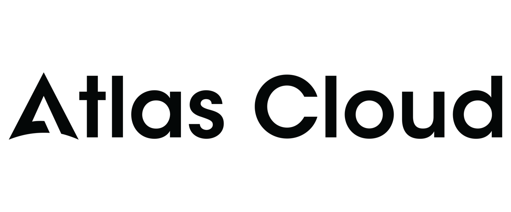
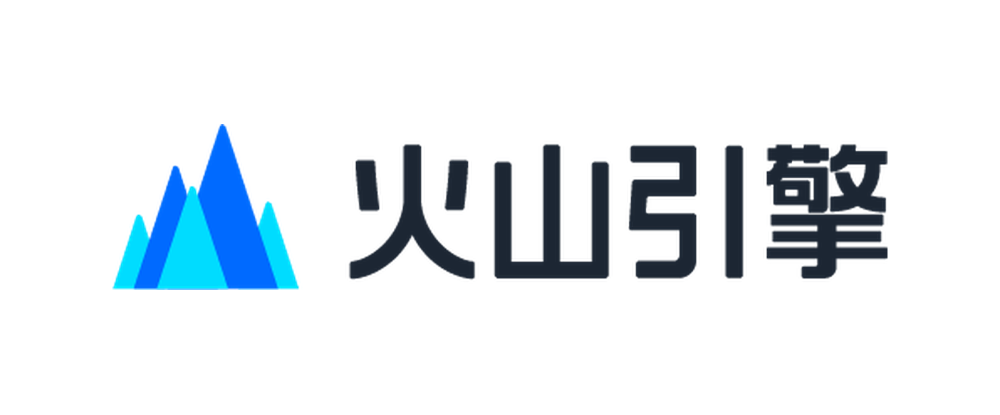

# RuoYi AI

<div align="center">

[![Contributors][contributors-shield]][contributors-url]
[![Forks][forks-shield]][forks-url]
[![Stargazers][stars-shield]][stars-url]
[![Issues][issues-shield]][issues-url]
[![MIT License][license-shield]][license-url]


<p align="center">
  <a href="https://trendshift.io/repositories/13209">
    
  </a>
</p>


### 企业级AI助手平台

*开箱即用的全栈AI平台，支持多智能体协同、Supervisor模式编排、多种决策模式、RAG技术和流程编排能力*

**[English](README_EN.md)** | **[📖 使用文档](https://doc.ruoyiai.chat/)** |
**[🚀 在线体验](https://web.ruoyiai.chat/)** | **[🐛 问题反馈](https://github.com/ageerle/ruoyi-ai/issues)** | **[💡 功能建议](https://github.com/ageerle/ruoyi-ai/issues)**

</div>


## ✨ 核心亮点

|     模块     | 现有能力 
|:----------:|---
|  **模型管理**  | 多模型接入(OpenAI/DeepSeek/通义/智谱/MiniMax)、多模态理解、Coze/DIFY/FastGPT平台集成
|  **知识管理**  | 本地RAG + 向量库(Milvus/Weaviate/Qdrant)  + 文档解析
|  **工具管理**  | Mcp协议集成、Skills能力 + 可扩展工具生态                             
|  **流程编排**  | 可视化工作流设计器、节点拖拽编排、SSE流式执行,目前已经支持模型调用,邮件发送,人工审核等节点  
|  **多智能体**  | 基于Langchain4j的Agent框架、Supervisor模式编排,支持多种决策模型          


### 项目源码

| 项目模块     | GitHub 仓库                                             | Gitee 仓库                                             | GitCode 仓库                                             |
|----------|-------------------------------------------------------|------------------------------------------------------|--------------------------------------------------------|
| 🔧 后端服务  | [ruoyi-ai](https://github.com/ageerle/ruoyi-ai)       | [ruoyi-ai](https://gitee.com/ageerle/ruoyi-ai)       | [ruoyi-ai](https://gitcode.com/ageerle/ruoyi-ai)       |
| 🎨 用户前端  | [ruoyi-web](https://github.com/ageerle/ruoyi-web)     | [ruoyi-web](https://gitee.com/ageerle/ruoyi-web)     | [ruoyi-web](https://gitcode.com/ageerle/ruoyi-web)     |
| 🛠️ 管理后台 | [ruoyi-admin](https://github.com/ageerle/ruoyi-admin) | [ruoyi-admin](https://gitee.com/ageerle/ruoyi-admin) | [ruoyi-admin](https://gitcode.com/ageerle/ruoyi-admin) |

### 合作项目
| 项目名称           | GitHub 仓库                                             | Gitee 仓库                                             
|----------------|-------------------------------------------------------|------------------------------------------------------|
| element-plus-x | [element-plus-x](https://github.com/element-plus-x/Element-Plus-X)       | [element-plus-x](https://gitee.com/he-jiayue/element-plus-x)       | 

## 🛠️ 技术架构

### 核心框架
- **后端架构**：Spring Boot 3.5.8 + Langchain4j
- **数据存储**：MySQL 8.0 + Redis + 向量数据库（Milvus/Weaviate/Qdrant）
- **前端技术**：Vue 3 + Vben Admin + element-plus-x
- **安全认证**：Sa-Token + JWT 双重保障
- **文档处理**：PDF、Word、Excel 解析，图像智能分析
- **实时通信**：WebSocket 实时通信，SSE 流式响应
- **系统监控**：完善的日志体系、性能监控、服务健康检查

## 🐳 Docker 部署

本项目提供两种 Docker 部署方式：

### 方式一：一键启动所有服务（推荐）

使用 `docker-compose-all.yaml` 可以一键启动所有服务（包括后端、管理端、用户端及依赖服务）：

```bash
# 克隆仓库
git clone https://github.com/ageerle/ruoyi-ai.git
cd ruoyi-ai

# 启动所有服务（从镜像仓库拉取预构建镜像）
docker-compose -f docker-compose-all.yaml up -d

# 查看服务状态
docker-compose -f docker-compose-all.yaml ps

# 访问服务
# 管理端: http://localhost:25666 (admin / admin123)
# 用户端: http://localhost:25137
# 后端API: http://localhost:26039
```

### 方式二：分步部署（源码编译）

如果您需要从源码构建后端服务，请按照以下步骤操作：

#### 第一步：部署后端服务

```bash
# 进入后端项目目录
cd ruoyi-ai

# 启动后端服务（源码编译构建）
docker-compose up -d --build

# 等待后端服务启动完成
docker-compose logs -f backend
```

#### 第二步：部署管理端

```bash
# 进入管理端项目目录
cd ruoyi-admin

# 构建并启动管理端
docker-compose up -d --build

# 访问管理端
# 地址: http://localhost:5666
```

#### 第三步：部署用户端（可选）

```bash
# 进入用户端项目目录
cd ruoyi-web

# 构建并启动用户端
docker-compose up -d --build

# 访问用户端
# 地址: http://localhost:5137
```

### 服务端口说明

| 服务 | 一键启动端口 | 分步部署端口 | 说明 |
|------|-------------|-------------|------|
| 管理端 | 25666 | 5666 | 管理后台访问地址 |
| 用户端 | 25137 | 5137 | 用户前端访问地址 |
| 后端服务 | 26039 | 6039 | 后端 API 服务 |
| MySQL | 23306 | 23306 | 数据库服务 |
| Redis | 26379 | 6379 | 缓存服务 |
| Weaviate | 28080 | 28080 | 向量数据库 |
| MinIO API | 29000 | 9000 | 对象存储 API |
| MinIO Console | 29090 | 9090 | 对象存储控制台 |

### 镜像仓库

所有镜像托管在阿里云容器镜像服务：

```
crpi-31mraxd99y2gqdgr.cn-beijing.personal.cr.aliyuncs.com/ruoyi_ai
```

可用镜像：
- `mysql:v3` - MySQL 数据库（包含初始化 SQL）
- `redis:6.2` - Redis 缓存
- `weaviate:1.30.0` - 向量数据库
- `minio:latest` - 对象存储
- `ruoyi-ai-backend:latest` - 后端服务
- `ruoyi-ai-admin:latest` - 管理端前端
- `ruoyi-ai-web:latest` - 用户端前端

### 常用命令

```bash
# 停止所有服务
docker-compose -f docker-compose-all.yaml down

# 查看服务日志
docker-compose -f docker-compose-all.yaml logs -f [服务名]

# 重启某个服务
docker-compose -f docker-compose-all.yaml restart [服务名]
```

## 📚 使用文档

想要深入了解安装部署、功能配置和二次开发？

**👉 [完整使用文档](https://doc.ruoyiai.chat/)**

## 🤝 参与贡献

我们热烈欢迎社区贡献！无论您是资深开发者还是初学者，都可以为项目贡献力量 💪

### 贡献方式

1. **Fork** 项目到您的账户
2. **创建分支** (`git checkout -b feature/新功能名称`)
3. **提交代码** (`git commit -m '添加某某功能'`)
4. **推送分支** (`git push origin feature/新功能名称`)
5. **发起 Pull Request**

> 💡 **小贴士**：建议将 PR 提交到 GitHub，我们会自动同步到其他代码托管平台

## 📄 开源协议

本项目采用 **MIT 开源协议**，详情请查看 [LICENSE](LICENSE) 文件。

## 🙏 特别鸣谢

感谢以下优秀的开源项目为本项目提供支持：
- [Langchain4j](https://github.com/langchain4j/langchain4j) - 强大的 Java LLM 开发框架
- [RuoYi-Vue-Plus](https://gitee.com/dromara/RuoYi-Vue-Plus) - 成熟的企业级快速开发框架
- [Vben Admin](https://github.com/vbenjs/vue-vben-admin) - 现代化的 Vue 后台管理模板


## 💎 赞助商

**感谢以下赞助商对本项目的支持：**

<a href="https://www.atlascloud.ai?ref=89F97E">
  
</a>

[访问Atlas Cloud官网](https://www.atlascloud.ai?ref=89F97E) · [编程计划优惠](https://www.atlascloud.ai/console/coding-plan)
全模态 AI 推理平台，为开发者提供统一的 AI API，支持视频生成、图像生成和大语言模型。一次接入，即可访问 **300+ 精选模型**。

<a href="https://www.volcengine.com/activity/codingplan?utm_campaign=hw&utm_content=hw&utm_medium=devrel_tool_web&utm_source=OWO&utm_term=ageerle-ruoyi-ai">
  
</a>

[火山引擎 CodingPlan 开发者计划](https://www.volcengine.com/activity/codingplan?utm_campaign=hw&utm_content=hw&utm_medium=devrel_tool_web&utm_source=OWO&utm_term=ageerle-ruoyi-ai)
火山引擎是字节跳动旗下的云与 AI 服务平台，火山方舟提供豆包大模型、DeepSeek 等多种模型的 API 接入，为开发者提供一站式 AI 开发与推理服务。


## 💬 社区交流

<div align="center">

<table>
<tr>
<td align="center">
<br>
<strong>扫码添加作者微信</strong><br>
<em>邀请进群学习</em>
</td>
<td align="center">
<br>
<strong>微信技术交流群</strong><br>
<em>技术讨论</em>
</td>
<td align="center">
<br>
<strong>QQ技术交流群</strong><br>
<em>技术讨论</em>
</td>

</tr>
</table>

</div>

---
<div align="center">

**[⭐ 点个Star支持一下](https://github.com/ageerle/ruoyi-ai)** • **[ Fork 开始贡献](https://github.com/ageerle/ruoyi-ai/fork)** • **[📚 English](README_EN.md)** • **[📖 查看完整文档](https://doc.ruoyiai.chat/)**

*用 ❤️ 打造，由 RuoYi AI 开源社区维护*

</div>

<!-- Badge Links -->

[contributors-shield]: https://img.shields.io/github/contributors/ageerle/ruoyi-ai.svg?style=flat-square

[contributors-url]: https://github.com/ageerle/ruoyi-ai/graphs/contributors

[forks-shield]: https://img.shields.io/github/forks/ageerle/ruoyi-ai.svg?style=flat-square

[forks-url]: https://github.com/ageerle/ruoyi-ai/network/members

[stars-shield]: https://img.shields.io/github/stars/ageerle/ruoyi-ai.svg?style=flat-square

[stars-url]: https://github.com/ageerle/ruoyi-ai/stargazers

[issues-shield]: https://img.shields.io/github/issues/ageerle/ruoyi-ai.svg?style=flat-square

[issues-url]: https://github.com/ageerle/ruoyi-ai/issues

[license-shield]: https://img.shields.io/github/license/ageerle/ruoyi-ai.svg?style=flat-square

[license-url]: https://github.com/ageerle/ruoyi-ai/blob/main/LICENSE
