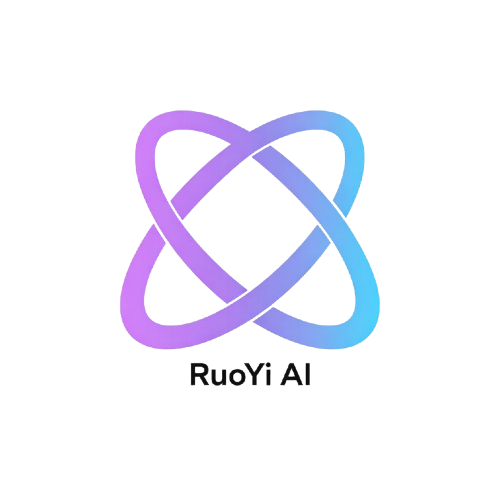

# RuoYi AI

[![Contributors][contributors-shield]][contributors-url]
[![Forks][forks-shield]][forks-url]
[![Stargazers][stars-shield]][stars-url]
[![Issues][issues-shield]][issues-url]
[![MIT License][license-shield]][license-url]

  

### Enterprise-Grade AI Assistant Platform

*An out-of-the-box intelligent AI platform that integrates mainstream AI platforms such as Coze and DIFY, providing advanced RAG technology, knowledge graphs, digital humans, and AI workflow orchestration capabilities*

**[中文](README.md)** | **[📖 Documentation](https://doc.pandarobot.chat)** |
**[🚀 Live Demo](https://web.pandarobot.chat)** | **[🐛 Report Issues](https://github.com/ageerle/ruoyi-ai/issues)** | **[💡 Feature Requests](https://github.com/ageerle/ruoyi-ai/issues)**

## ✨ Core Features

### Intelligent AI Engine
- **Multi-Model Integration**: Supports mainstream LLM providers including OpenAI, DeepSeek, Alibaba's Tongyi Qianwen, and Zhipu AI
- **Multi-Modal Understanding**: Intelligently processes multiple formats including text, images, and documents
- **AI Platform Integration**: Integrates mainstream AI application platforms like **Coze**, **DIFY**, and **FastGPT**
- **MCP Capability Integration**: Build an extensible AI toolkit ecosystem based on the Model Context Protocol
- **AI Coding Assistant**: Built-in intelligent code analysis and project scaffolding generation capabilities

### Local RAG Solution
- **Private Knowledge Base**: Implements local private knowledge base based on Langchain4j framework + BGE-large-zh-v1.5 Chinese vector model
- **Multiple Vector Databases**: Supports mainstream vector databases including Milvus, Weaviate, and Qdrant
- **Data Security & Privacy**: Supports fully local deployment to protect enterprise data privacy
- **Flexible Model Deployment**: Compatible with local inference frameworks like Ollama and vLLM

### AI Creative Tools
- **AI Image Generation**: Integrates MidJourney and GPT-4o-image
- **Intelligent PPT Generation**: Convert text content to beautiful presentations with one click

### Knowledge Graph & Intelligent Orchestration
- **Knowledge Graph Construction**: Automatically extract entity relationships from documents and conversations, build visualized knowledge networks
- **AI Workflow Orchestration**: Visual workflow designer supporting complex AI task orchestration and automated execution
- **Digital Human Interaction**: Integrated digital avatars providing more natural human-machine interaction experience

## 🚀 Quick Start

### Live Demo

- **User Experience**: [web.pandarobot.chat](https://web.pandarobot.chat) (Username: admin, Password: admin123)
- **Admin Dashboard**: [admin.pandarobot.chat](https://admin.pandarobot.chat) (Username: admin, Password: admin123)

### Project Repositories

| Module           | GitHub Repository                                      | Gitee Repository                                      | GitCode Repository                                      |
|------------------|-------------------------------------------------------|------------------------------------------------------|--------------------------------------------------------|
| 🔧 Backend       | [ruoyi-ai](https://github.com/ageerle/ruoyi-ai)       | [ruoyi-ai](https://gitee.com/ageerle/ruoyi-ai)       | [ruoyi-ai](https://gitcode.com/ageerle/ruoyi-ai)       |
| 🎨 User Frontend | [ruoyi-web](https://github.com/ageerle/ruoyi-web)     | [ruoyi-web](https://gitee.com/ageerle/ruoyi-web)     | [ruoyi-web](https://gitcode.com/ageerle/ruoyi-web)     |
| 🛠️ Admin Panel   | [ruoyi-admin](https://github.com/ageerle/ruoyi-admin) | [ruoyi-admin](https://gitee.com/ageerle/ruoyi-admin) | [ruoyi-admin](https://gitcode.com/ageerle/ruoyi-admin) |

## 🛠️ Technical Architecture

### Core Framework
- **Backend**: Spring Boot 3.5 + Langchain4j
- **Data Storage**: MySQL 8.0 + Redis + Vector Databases (Milvus/Weaviate/Qdrant)
- **Frontend**: Vue 3 + Vben Admin + Element UI
- **Security**: Sa-Token + JWT dual-layer security

### System Components
- **Document Processing**: PDF, Word, and Excel parsing with intelligent image analysis
- **Real-Time Communication**: WebSocket real-time communication with SSE streaming responses
- **System Monitoring**: Comprehensive logging system, performance monitoring, and service health checks

## 📚 Documentation

Want to learn more about installation, deployment, configuration, and secondary development?

**👉 [Complete Documentation](https://doc.pandarobot.chat)**

## 🤝 Contributing

We warmly welcome community contributions! Whether you are a seasoned developer or just getting started, you can contribute to the project 💪

### How to Contribute

1. **Fork** the project to your account
2. **Create a branch** (`git checkout -b feature/new-feature-name`)
3. **Commit your changes** (`git commit -m 'Add new feature'`)
4. **Push to the branch** (`git push origin feature/new-feature-name`)
5. **Create a Pull Request**

> 💡 **Tip**: We recommend submitting PRs to GitHub, we will automatically sync to other code hosting platforms

## 📄 License

This project is licensed under the **MIT License**. See the [LICENSE](LICENSE) file for details.

## 🙏 Acknowledgments

Thanks to the following excellent open-source projects for their support:
- [Spring AI Alibaba Copilot](https://github.com/spring-ai-alibaba/copilot) - Intelligent coding assistant based on spring-ai-alibaba
- [Langchain4j](https://github.com/langchain4j/langchain4j) - Powerful Java LLM development framework
- [RuoYi-Vue-Plus](https://gitee.com/dromara/RuoYi-Vue-Plus) - Mature enterprise-level rapid development framework
- [Vben Admin](https://github.com/vbenjs/vue-vben-admin) - Modern Vue admin template

## 🌐 Ecosystem Partners

- [PPIO Cloud](https://ppinfra.com/user/register?invited_by=P8QTUY&utm_source=github_ruoyi-ai) - Provides cost-effective GPU computing and model API services
- [Youyun Intelligent Computing](https://www.compshare.cn/?ytag=GPU_YY-gh_ruoyi) - Thousands of RTX40 series GPUs + mainstream models API services, second-level response, pay-per-use, free for new customers.

## Outstanding Open-Source Projects and Community Recommendations
- [imaiwork](https://gitee.com/tsinghua-open/imaiwork) - Open-source AI phone, AI customer acquisition phone project, based on accessibility mode and RPA, more powerful than Doubao AI phone.

## 💬 Community Chat

<table>
<tr>
<td align="center">
 
<strong>Scan to Add Author's WeChat</strong> 
<em>Invitation to join the group</em>
</td>
<td align="center">
 
<strong>QQ Technical Discussion Group</strong> 
<em>Technical discussions</em>
</td>

</tr>
</table>

---

**[⭐ Star to Support](https://github.com/ageerle/ruoyi-ai)** • **[Fork to Contribute](https://github.com/ageerle/ruoyi-ai/fork)** • **[📚 中文](README.md)** • **[📖 Complete Documentation](https://doc.pandarobot.chat)**

*Built with ❤️, maintained by the RuoYi AI open-source community*

<!-- Badge Links -->

[contributors-shield]: https://img.shields.io/github/contributors/ageerle/ruoyi-ai.svg?style=flat-square

[contributors-url]: https://github.com/ageerle/ruoyi-ai/graphs/contributors

[forks-shield]: https://img.shields.io/github/forks/ageerle/ruoyi-ai.svg?style=flat-square

[forks-url]: https://github.com/ageerle/ruoyi-ai/network/members

[stars-shield]: https://img.shields.io/github/stars/ageerle/ruoyi-ai.svg?style=flat-square

[stars-url]: https://github.com/ageerle/ruoyi-ai/stargazers

[issues-shield]: https://img.shields.io/github/issues/ageerle/ruoyi-ai.svg?style=flat-square

[issues-url]: https://github.com/ageerle/ruoyi-ai/issues

[license-shield]: https://img.shields.io/github/license/ageerle/ruoyi-ai.svg?style=flat-square

[license-url]: https://github.com/ageerle/ruoyi-ai/blob/main/LICENSE